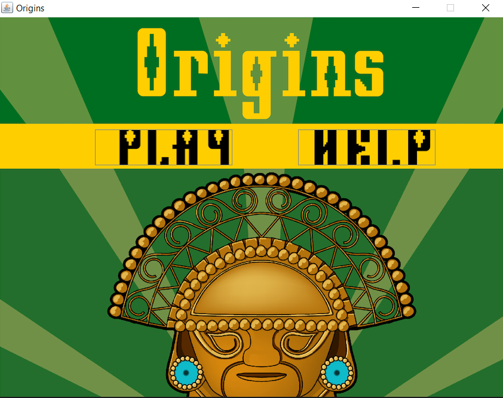
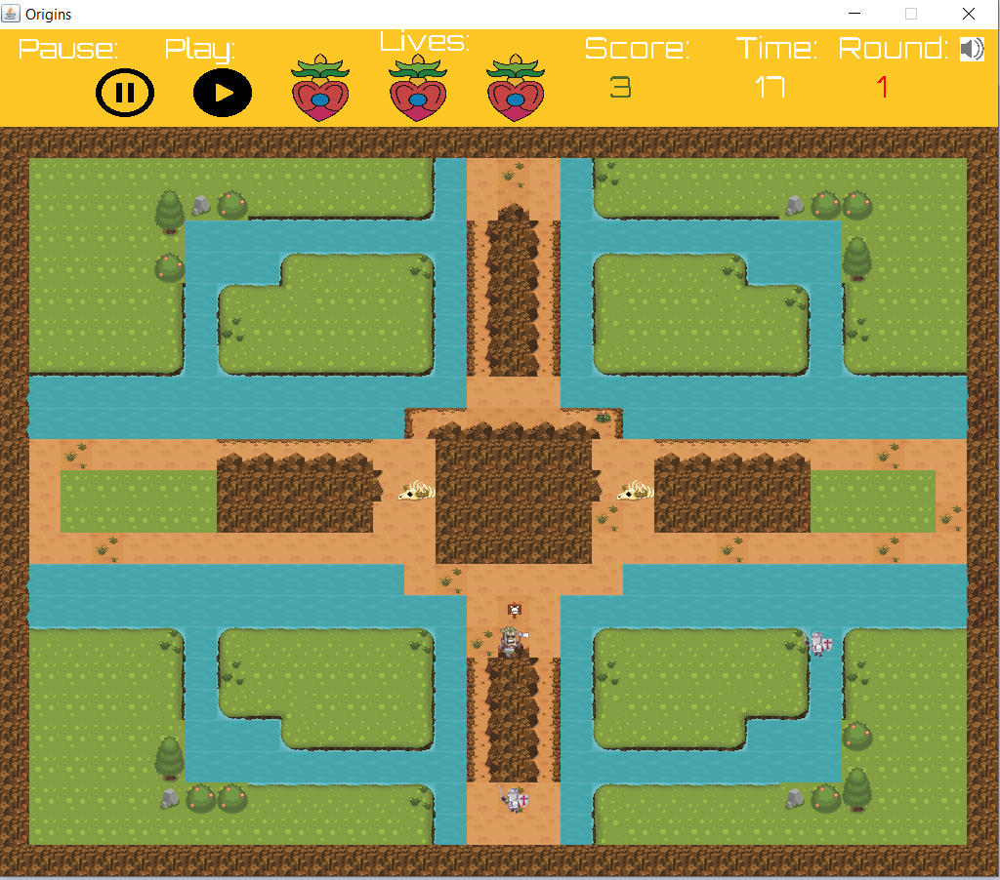
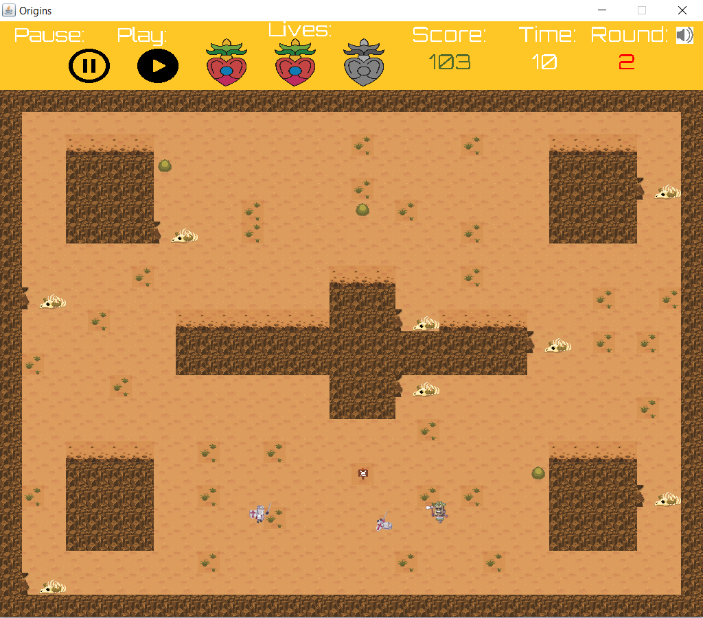
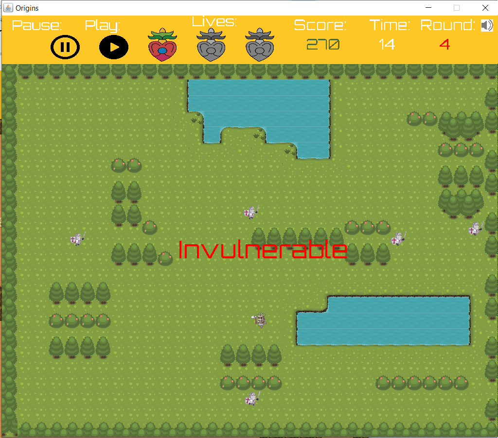
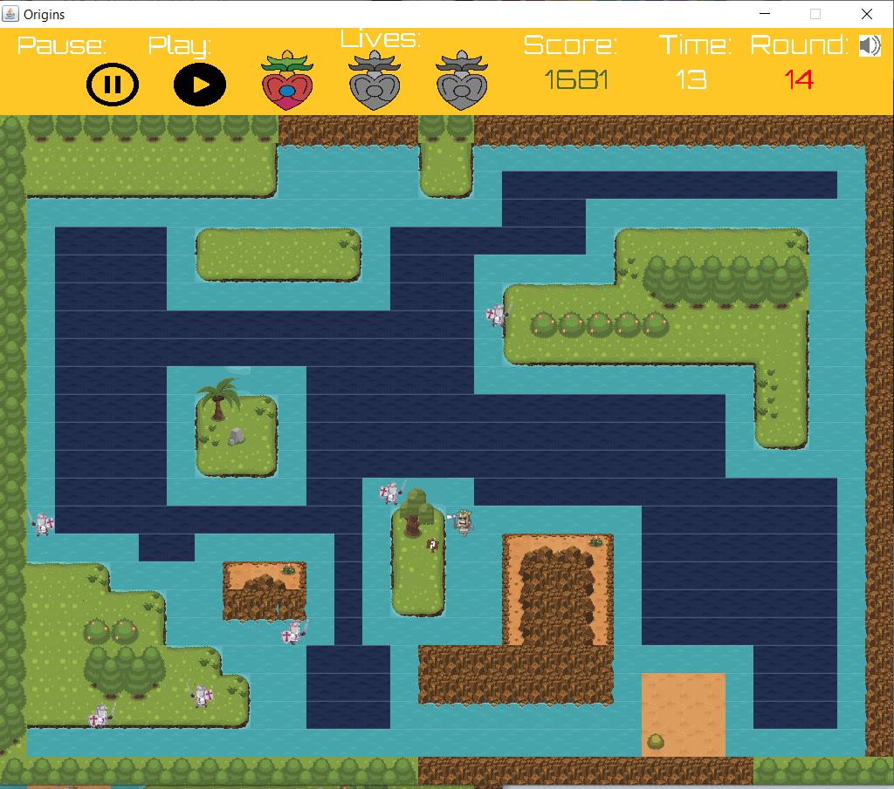
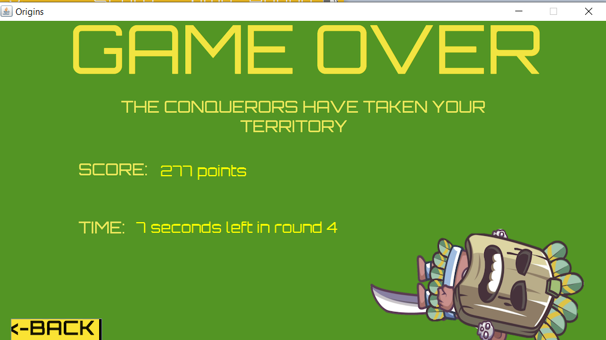

# Origins
Final team project for the Videogame Project course.

Origins is an action game where you control a native Aztec during the first Viceroyalty of New Spain around the year 1600. 
You must survive as many timed rounds as you can killing any enemy colonizer that crosses your path.

## Screenshots
#### Main Menu

#### 4 different areas

#### Kill enemies

#### Watch out enemies can also hurt you!

#### Survive as many rounds as possible

#### Game Over

